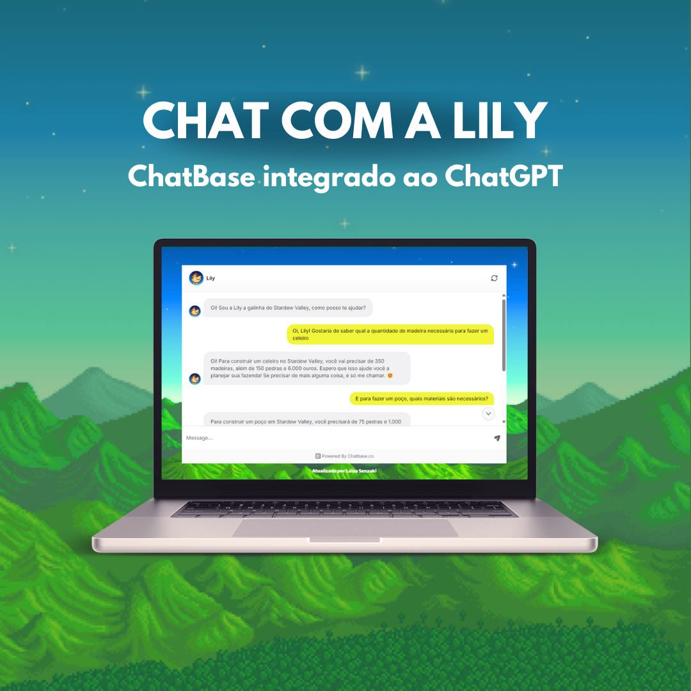

# StardewValley_ChatBot
<h1 align="center"> Stardew Valley ChatBot </h1>

ChatBot integrado com o ChatGPT sobre o jogo StardewValley. 

  <a href="#-tecnologias">Tecnologias</a>&nbsp;&nbsp;&nbsp;|&nbsp;&nbsp;&nbsp;
  <a href="#-projeto">Projeto</a>&nbsp;&nbsp;&nbsp;|&nbsp;&nbsp;&nbsp;
  <a href="#-layout">Layout</a>&nbsp;&nbsp;&nbsp;|&nbsp;&nbsp;&nbsp;
  <a href="#memo-licença">Licença</a>

  

 

  

## 🚀 Tecnologias

Esse projeto foi desenvolvido com as seguintes tecnologias:

- HTML e CSS
- ChatBase
- Git e Github
- Figma

## 💻 Projeto

O Projeto em questão fornece um chat de conversa escrita com a Lily, uma galinha que sabe tudo sobre StardewValley. 
Nesse Chat você consegue obter todo tipo de informação sobre o jogo, é só perguntar para a Lily!